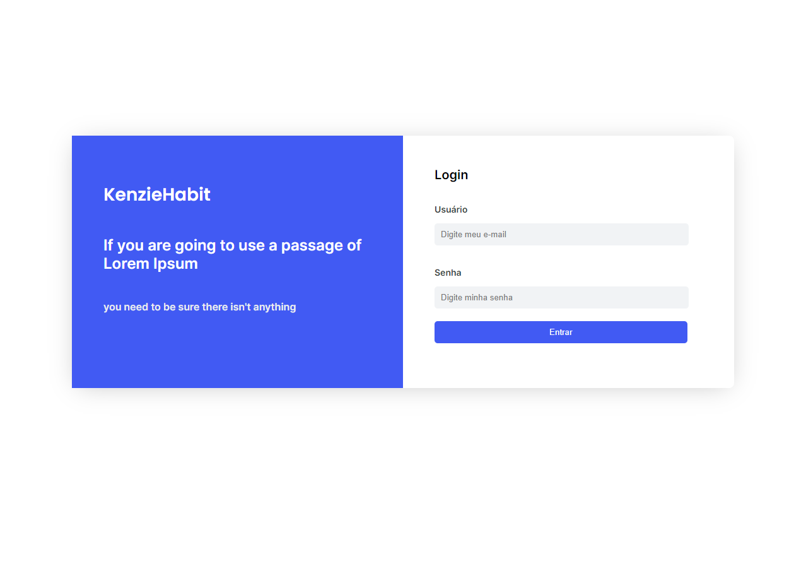
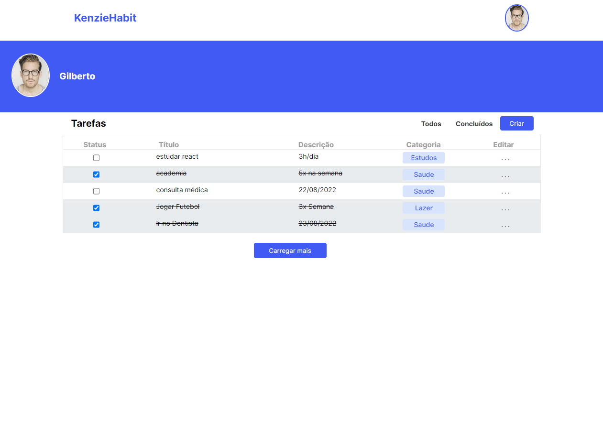
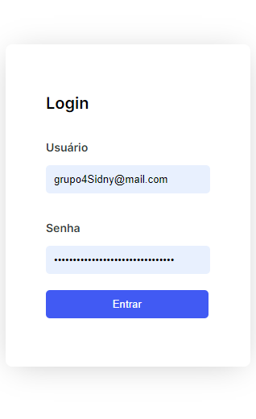
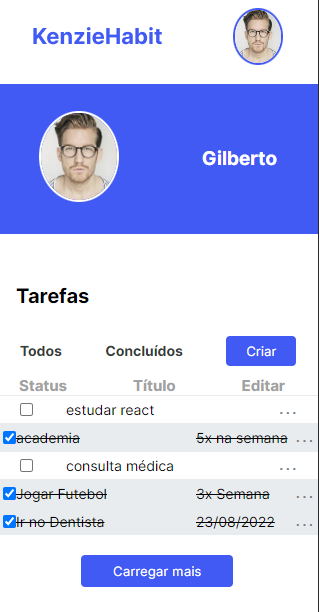

# Kenzie-Habit

Este é um projeto acadêmico realizado no final do segundo módulo do curso de Full-Stack na Kenzy Academy Brasil. É um app voltado ao usuário que deseje organizar sua rotina, podendo adicionar tarefas e marcar as mesmas como concluídas.

## Visite o site!!

https://edmar-cardoso.github.io/M2CapstoneGrupo04/index.html

O site não possui uma página de cadastro, pois o banco de dados é bem simples e não suportaria muitos usuários. Por esse motivo caso queira logar no site use esse usuário:

- Email: grupo4Sidny@mail.com
- Senha: 5e2fb1b3478fda37b148dccd4f09cac5

## Layout

### Desktop

Login:

HomePage:

### Mobile

Login:

HomePage:

##### Tecnologias usadas:

- HTML
- CSS
- JavaScript
- API REST
- Scrum

##### Créditos:

- Layout, banco de dados e API fonecidos pela Kenzie Academy Brasil
- Desenvolvido por [Edmar-Cardoso](https://github.com/Edmar-Cardoso), [Enrique-Barbosa](https://github.com/enriquebds), [João-Reis](https://github.com/reisquaza) e [Paulo-Gustavo](https://github.com/ArkanumBR)
